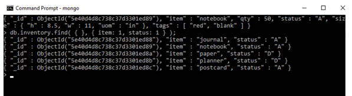

# Laporan

Buka sofware mongoDB

Setelah itu klik Next untuk melanjutkan

Berikan tanda centang untuk melanjutkan penginstalan

Pilih complit untuk melanjutkan penginstalan

kemudian klik nesxt lagi

Kemudian klik next lagi

Kemudian klik instal untuk memulai penginstalan aplikasi

Gambar diatas telah melakukan penginstalan

Penginstalan telah selesai klik finish

Operasi harus mengembalikan tes, yang merupakan basis data default

Contoh berikut menggunakan metode db.collection.insertMany () untuk menyisipkan dokumen baru ke dalam koleksi inventaris. Anda dapat menyalin dan menempelkan contoh ke shell di atas.

Di shell, salin dan tempel yang berikut untuk mengembalikan semua dokumen dalam koleksi inventaris

Untuk memformat hasil, tambahkan .pretty () ke operasi find:

Dalam shell, salin dan tempel yang berikut untuk mengembalikan dokumen yang bidang isinya sama dengan "D"

Dalam shell, salin dan tempel berikut ini untuk mengembalikan dokumen dengan bidang qty sama dengan 0

Dalam shell, salin dan tempel berikut ini untuk mengembalikan dokumen dengan bidang qty sama dengan 0 dan bidang status sama dengan "D"

Dalam shell, salin dan tempel berikut ini untuk mengembalikan dokumen tempat bidang uom, bersarang di dalam dokumen ukuran, sama dengan "in"

Dalam shell, salin dan tempel berikut ini untuk mengembalikan dokumen yang bidang isinya sama dengan dokumen {h: 14, w: 21, uom: "cm"}

Dalam shell, salin dan tempel berikut ini untuk mengembalikan dokumen yang bidang isinya sama dengan dokumen {h: 14, w: 21, uom: "cm"}

Dalam shell, salin dan rekatkan yang berikut untuk mengembalikan dokumen yang bidang tagnya cocok dengan array yang ditentukan, termasuk urutannya

Dalam shell, salin dan tempel yang berikut untuk mengembalikan _id, item, dan bidang status dari semua dokumen dalam koleksi inventaris

Anda tidak harus menentukan bidang _id untuk mengembalikan bidang. Ini kembali secara default. Untuk mengecualikan bidang, atur ke 0 dalam dokumen proyeksi. Misalnya, salin dan tempel berikut ini untuk hanya mengembalikan item, dan bidang status dalam dokumen yang sesuai

Di MongoDB, masukkan target operasi satu koleksi. Semua operasi penulisan di MongoDB adalah atom pada tingkat satu dokumen

Anda dapat menentukan filter kueri atau kriteria yang mengidentifikasi dokumen untuk dikembalikan.

Anda dapat menentukan kriteria, atau filter, yang mengidentifikasi dokumen yang akan diperbarui. Filter ini menggunakan sintaks yang sama dengan operasi baca.

